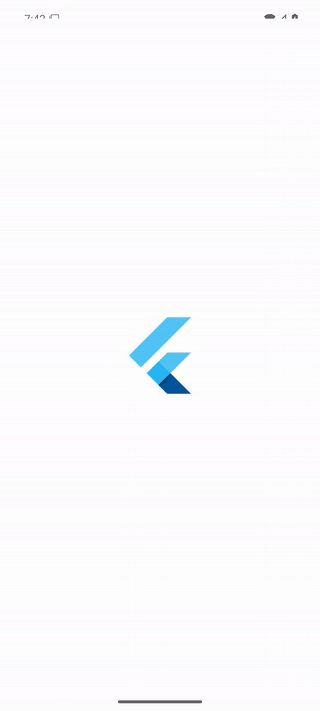

# Codegeist App

Codegeist App is an Android client for private, local Codegeist model inference.

## Current State

The repository contains a minimal Android-only Flutter chat application. Its
start screen displays the reviewed Codegeist horizontal logo and an explicit
model-load action. The first load downloads and verifies the pinned 1.11 GB
Codegeist GGUF in application-private storage; later loads reuse that file. Once
loaded, the app runs a single in-memory, CPU-only conversation and streams model
responses into the chat surface.

Each model-load request first shows an Alpha Preview disclosure covering the
experimental model, possible unsafe or inaccurate output, local processing,
download size, and non-professional-use boundary. Cancelling the disclosure
starts no model work.

Conversation persistence, multiple chats, remote inference, model selection,
Vulkan, tools, attachments, and background inference are not implemented.



## Local Model

Press `Load model` in the application to download and start the model. The app
uses `codegeist/codegeist-llm` file
`gguf/codegeist-llm-Q4_K_M.gguf` from immutable revision
`ce073afd34b725825b19089cec1a9e7b884b2fbe` and rejects bytes that do not match
SHA-256
`be7824de2fc34955d640e30e41e92dd66206e86ab7fe027084015a9b7da44fce`.
Interrupted downloads can resume. Clearing application data or uninstalling the
app removes the cached model.

Inference uses llama.cpp on CPU with a 2048-token context and responses capped
at 256 generated tokens. A 64-bit Android 13 (API 33) or newer device with at
least 4 GB RAM and approximately 2 GB free application storage is recommended.
The current model is an experimental identity artifact; its publication does
not establish broad chat or coding quality.

The repository build and Android launch workflows package only `arm64-v8a` and
`x86_64`, matching the available llama.cpp runtime bundles. Model weights are
never included in the APK.

## Toolchain

The shared `.devcontainer/` image is extended by `.codegeist/Dockerfile` with
the project-specific Flutter and Android toolchain:

- Flutter 3.47.0 and Dart 3.13.0
- Temurin JDK 21.0.12+8
- Android API 36 and Build Tools 36.0.0
- Current Android Emulator, Platform Tools, and Google APIs x86_64 API 36 image
- scrcpy 4.1 for software-rendered visible mirroring

Direct downloads and explicitly addressable SDK packages remain versioned and
checksum-verified where applicable. Platform Tools, the emulator, API 36
platform revisions, and the API 36 system-image revision follow Google's current
SDK repository instead of failing the image build on routine revision updates.
JDK 21 is intentional: the shared GraalVM JDK 25 is suitable for other workspace
work, but this Android build fails in Gradle's `JdkImageTransform` when `jlink`
runs under that JDK.

After cloning and initializing the submodules, rebuild and open the project in
its devcontainer:

```bash
git submodule update --init .devcontainer .opencode
devcontainer up --workspace-folder .
```

The host must expose readable and writable `/dev/kvm` to Docker. The shared
devcontainer passes that device into its privileged workspace container.

## Development

Run the complete static, widget-test, and Android debug-build verification
inside the rebuilt devcontainer:

```bash
task verify
```

The individual commands remain available as `task analyze`, `task test`, and
`task build`. After exporting the four local `ANDROID_RELEASE_*` signing values
documented under
[`docs/android-release-apk.md`](docs/android-release-apk.md), use `task apk` to
build one universal ARM64/x86_64 release APK for stable direct installation.
Release builds fail instead of falling back to the debug key when signing input
is absent. Run `task --list` to display all repository entrypoints.

Start the dedicated `codegeist_api_36` AVD without a window, install the debug
APK, launch `ai.codegeist.app`, and verify its process:

```bash
task android
```

The headless command writes operation logs to stderr and prints the selected ADB
serial, `emulator-5556`, to stdout after success. It leaves the successfully
started AVD running for development and stops an AVD that it started if a later
workflow step fails or the command is interrupted.

Use visible mode only when the devcontainer has a working X11 transport:

```bash
task android:visible
```

Visible mode starts the AVD without its native Qt window and mirrors the Android
framebuffer through scrcpy's SDL software renderer. This avoids the gray guest
surface produced by the native emulator window over SSH-X11. The task remains
in the foreground while the mirror is open; closing the scrcpy window completes
the task and leaves a successfully started emulator running.

Before starting, visible mode refreshes `DISPLAY` from the generated
`.devcontainer/.env`, creates a private runtime directory, and normalizes
SSH-forwarded Xauthority aliases in a mode-`600` file. It exits with an
actionable `display_unavailable` diagnostic when X11 is not reachable and does
not weaken host display access controls. The Taskfile delegates both Android
modes to `scripts/android-avd.sh`; emulator lifecycle behavior remains in that
single script.

Repeated Android task invocations reuse `codegeist_api_36` when it is already
running on `emulator-5556`. A different AVD on that serial is rejected so the
workflow cannot install the application onto an unrelated emulator.

Run the Android runtime smoke test after application or AVD workflow changes:

```bash
task smoke
```

The smoke test builds and launches the app, then verifies the ADB device, app
process, resumed `MainActivity`, and Android UI semantics for the Codegeist logo
and `Load model` action. It does not start the model download. To run the same
checks and record the app restart within a six-second capture window:

```bash
task smoke:record
```

The recording is validated with `ffprobe` and written to
`.artifacts/codegeist-smoke.mp4`. `.artifacts/` is machine-local and ignored by
Git.

## GitHub Release APK

The manually triggered **Android release APK** GitHub Actions workflow builds
one release-signed universal ARM64/x86_64 APK from the committed `main` branch.
It receives the signing identity only from the protected GitHub `release`
environment. After the first successful workflow run, open the permanent public
link below on a compatible Android device, download the APK, and approve
Android's per-source **Install unknown apps** prompt:

[`Download codegeist.apk`](https://github.com/codegeist-ai/codegeist-app/releases/latest/download/codegeist.apk)

Each successful workflow run creates one versioned Release and updates the
**Latest** redirect behind that link. It is a direct `.apk` download, not a ZIP
or a time-limited Actions artifact.

Every published version must use the same protected release key and a higher
build number so Android can install it as an update. A previously installed
debug-signed build must be uninstalled once before the first release-signed
installation. See [`docs/github-release-apk.md`](docs/github-release-apk.md) for
the public build and download path and
[`docs/android-release-apk.md`](docs/android-release-apk.md) for release-key
custody, local release builds, and direct updates.

## Hosting

The private Gitea repository at
`https://git.codegeist.ai/codegeist/codegeist-app` is the primary write target.
The public GitHub repository at
`https://github.com/codegeist-ai/codegeist-app` is a push mirror of Git refs.

The mirror does not synchronize issues, pull requests, secrets, permissions,
Actions state, or other platform-specific data. Treat every committed ref as
public and never commit credentials, private prompts, restricted model
artifacts, or other non-public material.

## Workspace Kits

`.devcontainer/` and `.opencode/` are Git submodules that track the `release`
branches of the shared Codegeist development and agent kits. Initialize them
from this repository with:

```bash
git submodule update --init .devcontainer .opencode
```

Project-specific toolchain changes belong in `.codegeist/Dockerfile`; do not
edit the shared submodule contents for application requirements.

## License

Codegeist-authored source and documentation in this repository are licensed
under the [Zero-Clause BSD License](LICENSE). Future third-party runtimes and
model artifacts retain their own licenses and notice requirements.

The Codegeist logo under `assets/brand/` is Codegeist-controlled brand material,
not 0BSD software. Its app-local public-use approval, canonical design revision,
and integrity digest are recorded in `assets/brand/README.md`.
